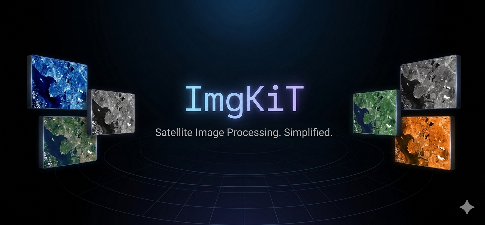
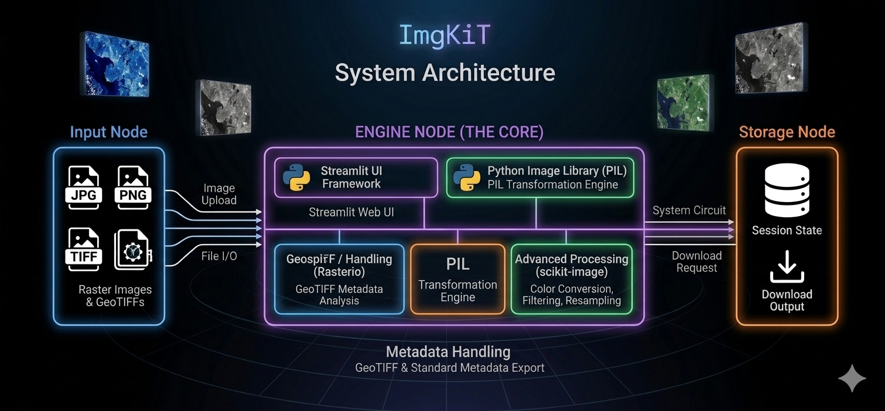

# ImgKIT

ImgKIT is a lightweight image manipulation and geospatial raster processing tool built using Python and Streamlit.

Developed during my ML internship, the project focuses on bridging digital image processing concepts with practical implementation on real raster and satellite imagery datasets.

---

# Features

## Image Processing
- Crop
- Greyscale Conversion
- Gaussian Blur
- Brightness & Contrast Adjustment
- Resampling Operations

## Resampling Methods
- Nearest Neighbour
- Bilinear
- Biquadratic
- Bicubic
- Biquartic
- Biquintic

## Histogram Analysis
- RGB Histogram Visualization
- Channel Toggle (R/G/B)
- Stretch Factor
- Adjustable Bin Range

## GeoTIFF Support
- Multi-band Raster Handling
- CRS Extraction
- Latitude/Longitude Mapping
- Metadata Extraction

## Bit Depth Conversion
- 8-bit
- 16-bit
- 32-bit Float

## Multi Output Workflow (v2.1)
- 1–4 Independent Outputs
- Parallel Processing
- Individual Download Support

---

# System Architecture

The following diagram represents the high-level architecture and workflow of ImgKIT.

---

# Tech Stack

- Python
- Streamlit
- NumPy
- scikit-image
- rasterio
- Pillow (PIL)
- matplotlib

---

# Version History

## v1.0
Core image manipulation pipeline with GeoTIFF metadata support.

## v2.0
Added histogram analysis, resampling methods, bit depth conversion, and improved UI workflow.

## v2.1
Implemented multi-output processing architecture with independent editing pipelines.

---

# Learning Outcome

This project strengthened my understanding of:
- Digital Image Processing
- Geospatial & Raster Data
- Image Resampling & Interpolation
- Histogram Analysis
- Streamlit-based UI Development
- SDLC-oriented project workflow

---

# Developer

M.A. Rehman Naseer  
ML Intern | Image Processing | Geospatial & Remote Sensing
